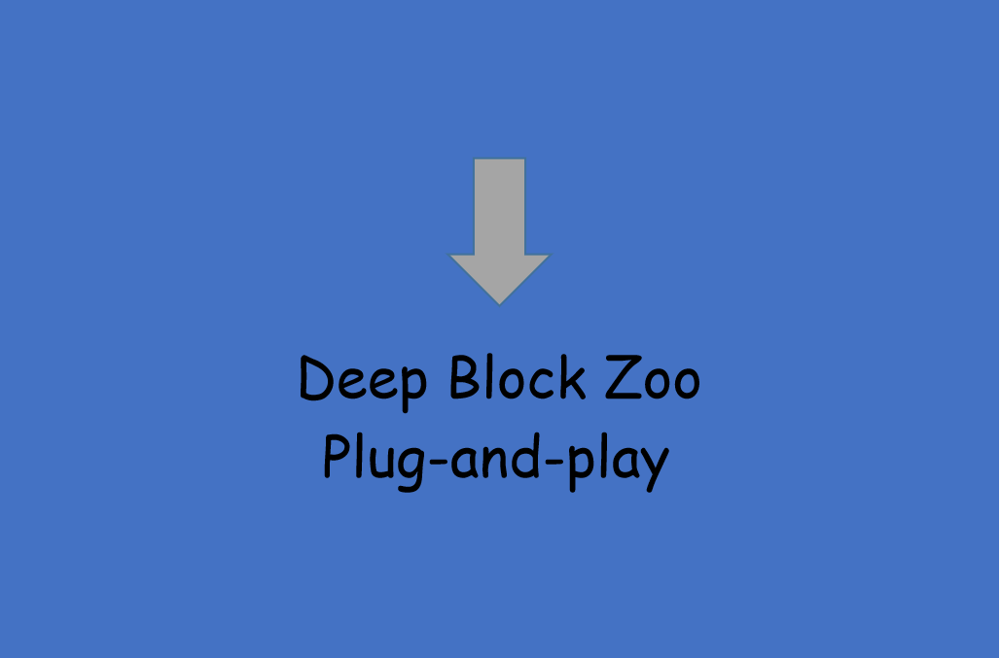

# Deep Block Zoo repository

    <h4 align="center"> </h4>

Some plug-and-play network modules.

These modules are separated from the classical network and they can help you improve the upper limit of your model.

| Block Name | Input Shape | Output Shape | Parameters(M) |
|:----:|:----:|:----:|:----:|
| NAF | 4, 16, 256, 256 | 4, 16, 256, 256 | 0.00232 |
| ASPP | 4, 16, 256, 256 | 4, 16, 256, 256 | 0.00145 |
| Non-local | 4, 16, 64, 64 | 4, 16, 64, 64 | 0.00051 |
| SE | 4, 16, 256, 256 | 4, 16, 256, 256 | 0.00003 |
| CBAM |4, 16, 256, 256 | 4, 16, 256, 256 | 0.00030 |
| DCN | 4, 16, 256, 256 | 4, 16, 256, 256 | 0.00491 |
| ASFF |4, 512, 64, 64; 4, 256, 128, 128; 4, 256, 256, 256 | 4, 256, 256, 256 | 0.73445 |
| RFB | 4, 16, 256, 256 | 4, 16, 256, 256 | 0.00137 |
| Ghost | 4, 16, 256, 256 | 4, 16, 256, 256 | 0.00023 |

## License
Deep Block Zoo is licensed under [Apache License Version 2.0](LICENSE).
